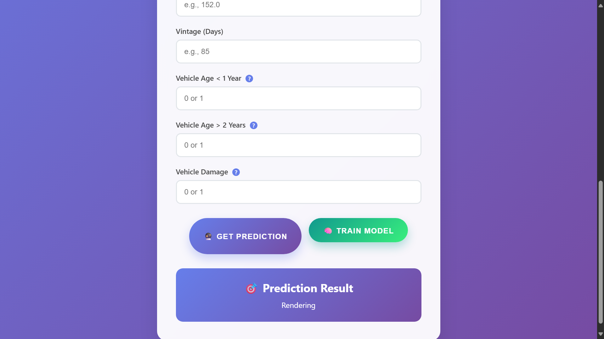

# Vehicle_Insurance
This project aims to impress recruiters and visitors by showcasing the various tools, techniques, services, and features that go into building and deploying a machine learning pipeline for real-world data management


---

## ⚙️ Tech Stack

- **Programming:** Python  
- **Database:** MongoDB  
- **Machine Learning:** scikit-learn, imbalanced-learn (SMOTEENN)  
- **Model:** Random Forest Classifier  
- **MLOps:** Logging, Artifacts Tracking , CICD , MLFLOW , AWS
- **Frontend:** HTML, CSS

---

## 📊 Evaluation Metrics

| Metric      | Score   |
|-------------|---------|
| **F1 Score**   | 0.93    |
| **Precision**  | 0.88    |
| **Recall**     | 0.98    |

---

## 🖥️ Demo (Screenshots)

🔹 **Input Form:**  


🔹 **Prediction Result:**  


---

## ▶️ How to Run

1. Clone the repo  
   ```bash
   git clone https://github.com/your-username/Vehicle_Insurance.git
   cd Vehicle_Insurance
